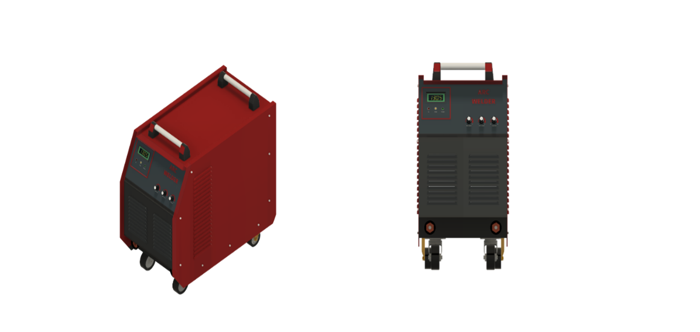

#  Introduction

***Shielded Metal Arc Welding (SMAW)***, usually referred to as manual metal arc welding is widely used in structural connections, pressure vessels, and maintenance and repair activities. This process is employed in numerous industrial applications because it is flexible, easy to use, and can be administered indoors and outdoors. The weld bead produced by SMAW is highly effected by the skill of the operator. In addition, the quality of the weldment is heavily influenced by input process parameters like current, voltage, arc gap, welding speed, electrode orientation, etc. The electrode consists of a wire of the same composition as that of the workpiece and it is coated with a layer of flux.
# Theory:
##Working Principle:
In a shielded metal arc welding process, an electric circuit that supports a welding arc is used to convert electrical power into heat. The intense and highly focused heat from the welding arc rapidly melts a section of the workpiece and the tip of the electrode. The electrode is gently touched to the workpiece and then slightly pulled back to start the arc. The welder controls the arc length by maintaining a consistent gap between the electrode and the workpiece. The heat generated by the arc leads to the melting of the electrode and workpiece and a weld pool is formed in the workpiece. The coated electrode melts during the welding process, the flux coating breaks down, releasing shielding gases and molten slag. The shielding gases and slag protect the weld area from airborne contaminants. After solidification of the slag, it has to be chipped away to expose the finished weld. 

####  Fig. 1 Schematic of the SMAW

In Fig. 1 schematic of the SMAW is shown. The electrode and the base material are connected to the power supply. There are two separate output terminals on the power supply. A connection is established to the workpiece through one terminal and the electrode using another terminal. When a DC power supply is used, the needed polarity for that type of electrode determines the appropriate terminal for electrode connection. During AC power supply, the electrode can be connected to any port. In case of DC power supply, the electrode is usually connected to the positive terminal also termed reverse polarity.                         

####  Fig. 2 Schematic of Shielded Metal arc welding Process

This welding process can be used to join metals in a variety of welding positions. The four main welding positions used in SMAW are flat position, horizontal position, vertical position, and overhead position.
1.	***Flat Position:*** This is the easiest position to weld in SMAW. The weld is made on a horizontal plane with the axis of the electrode perpendicular to the workpiece. The electrode is held at a slight angle to direct the molten metal onto the joint. In this position, the molten metal tends to flow evenly and smoothly, resulting in a flat, uniform bead.
2.	***Horizontal Position:*** In this position, the weld is made on a horizontal surface with the workpiece tilted at an angle of 45 degrees. The electrode is held at a slight angle to direct the molten metal into the joint. The molten metal tends to flow to one side of the joint, creating a "crown" or convex weld bead. 
3.	***Vertical Position:*** This position involves welding on a vertical surface with the axis of the electrode perpendicular to the workpiece. In this position, the molten metal tends to flow downwards, creating a "V" shaped groove. The direction of welding can be either uphill or downhill, depending on the joint design and welding parameters.
4.	***Overhead Position:*** This position involves welding on the underside of a horizontal surface. It is the most difficult welding position in SMAW because the molten metal tends to sag and fall off the joint. A smaller diameter electrode is typically used in this position to reduce the heat input and prevent the molten metal from sagging.

## Process parameters:
- ***Electrode diameter:*** the diameter of the electrode is an essential factor in SMAW. A larger diameter electrode increases the current carrying capacity of the arc and also increases the heat input. The correct electrode diameter should be selected based on the thickness of the material to be welded and the current settings.
-	***Electrode type:*** The choice of electrode type is vital for SMAW. An electrode with a low-hydrogen core wire and an appropriate flux coating should be selected for the application. Low hydrogen electrodes reduce the risk of hydrogen cracking in the weld.
-	***Welding current:*** The welding current should be set correctly for the application. Too much current can cause excessive spatter and undercut, while too little Current can cause incomplete fusion and porosity.
-	***Welding speed:*** The travel speed of the electrode is a crucial factor in SMAW. A Welding speed that is too fast can result in an undercut and poor fusion, whereas a slow welding speed can result in excessive heat input and distortion.
-	**Arc Length:** The arc length should be kept short for SMAW. A short arc length increases the stability of the arc and reduces the risk of porosity formation in the weld bead.

## Welding Equipment:
1.	***Power supply:*** The welding power source in a shielded metal arc welding (SMAW) is a critical component of the welding system. It provides the electrical energy needed to generate the arc that melts the electrode and base metal to form the weld. Two welding power sources are used in SMAW:  alternating current (AC) and direct current (DC).      The welding power source in SMAW typically has a control panel that allows the operator to adjust the welding current and voltage to optimize the welding process for the specific electrode and metal being used. Some welding power sources also have features such as over-voltage and overcurrent protection to prevent damage to the equipment and improve safety. A constant current power source with at least a 60% duty cycle at the maximum current is preferred for shielded arc welding. Since, Output electrical properties of Shielded metal arc welding require the welder to maintain constant arc length, which is almost impossible, a constant voltage power source is not employed. Constant current (CC) power sources are used in SMAW to maintain a constant current output regardless of changes in arc length. 

####  Fig.3. Power supply Transformer for SMAW

2.	***Electrode:*** An electrode consists of metal filler wire coated with various materials to provide shielding, deoxidizing, and alloying elements. The composition of electrode coating and the type of metal filler wire determines the welding characteristics of the electrode, including its welding current, electrode polarity, and the kind of metal being welded. Electrode coating may include rutile, calcium fluoride, cellulose, iron powder, etc. The flux layer provides shielding gases such as CO2, CO, and H2 to protect the weld pool from atmospheric oxidation. The flux layer also contributes to the slag formation and helps stabilize the arc. 
3.	***Electrode Holder:*** This holds the electrode and provides a means of conducting the electric current to the electrode.
4.	***Ground clamp:*** This provides a path for the return current from the workpiece to the power source.
5.	***Welding helmet:*** This protects the welder’s face and eyes from the welding arc's bright light and dangerous radiation.
6.	***Welding cables:*** These conduct electric current from the power source to the electrode holder.
7.	***Chipping hammer and wire brush:*** These are used to remove slag from the surface of the weld.

## Advantages:

1.	The apparatus is reasonably simple and portable.
2.	Shielding gas and granular flux are not needed.
3.	The SMAW electrode provides the filler material and insulation needed to create a strong weld.
4.	The method is adaptable and can be used for various joint types and welding positions.
5.	The method is appropriate for the majority of regularly used metals and alloys.

## Disadvantages:
1.	Shielded metal arc welding does not require welding metals with low melting temperatures, such as lead, tin, and zinc, and their alloys.
2.	The heat generated within the SMAW electrode will be excessive if the current is too high.
3.	Stub loss is also a drawback of shielded metal arc welding.
4.	The weld bead appearance produced by SMAW can be irregular and unattractive, making it less suitable for cosmetic applications.
5.	SMAW produces fumes and Smoke during welding, which can harm the welder without protective gear and proper ventilation.
